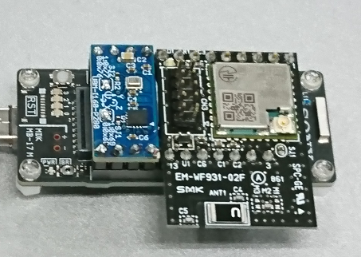

# BMI160

This driver is for BMI160 6DoF sensor breakout boards which are connected through the Arduino SPI.
Derived from the Intel's CurieIMU driver for the Arduino/Genuino 101.

Intel's driver repository: https://github.com/01org/corelibs-arduino101/tree/master/libraries/CurieIMU

BMI160: https://www.bosch-sensortec.com/bst/products/all_products/bmi160

## How to install
Copy all files of this project to the your Arduino IDE library folder.

Example:
```
cp ~/github/XXXXX/BMI160 ~/Documents/Arduino/libraries/
```

## Sensor board



## Wiring

### I2C mode
This board can connect only I2C.


## Code
```
#include <BMI160Gen.h>

const int select_pin = 10;
const int i2c_addr = 0x68;

void setup() {
  Serial.begin(115200); // initialize Serial communication
  while (!Serial);    // wait for the serial port to open

  // initialize device
  BMI160.begin(BMI160GenClass::SPI_MODE, select_pin);
  //BMI160.begin(BMI160GenClass::I2C_MODE, i2c_addr);
}

void loop() {
  int gx, gy, gz;         // raw gyro values

  // read raw gyro measurements from device
  BMI160.readGyro(gx, gy, gz);

  // display tab-separated gyro x/y/z values
  Serial.print("g:\t");
  Serial.print(gx);
  Serial.print("\t");
  Serial.print(gy);
  Serial.print("\t");
  Serial.print(gz);
  Serial.println();

  delay(500);
}
```

## Compatibility

